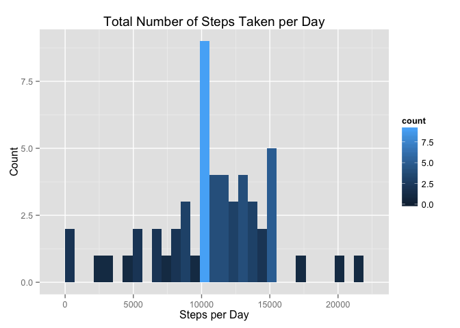

# Reproducible Research: Peer Assessment 1
S C NG  

## Introduction
This is a Reproducible Research Report created according to the requirements specified in [Peer Assessment 1][assignment_url] of Coursera course -- [Reproducible Research][course_url]. The source code of this report can be found at [author's github repository][github_url]. Figures in this report can be found in [this folder][github_figure_url]

Before proceeding the reproducible research, set default chunk option to echo all code chunks 

```r
library(knitr)
opts_chunk$set(echo=TRUE)
```

## Loading and preprocessing the data
+ Unzip activity.zip to get activity.csv file, and read the csv data into data frame

```r
unzip("activity.zip")
a <- read.csv("activity.csv", stringsAsFactors=FALSE, colClasses=c("numeric", "Date", "numeric"))
```

## What is mean total number of steps taken per day?
For this part of the assignment, we will ignore the missing values in the dataset.

1. Calculate the total number of steps taken per day
    + First of all, create a subset of data which does not contain "NA" steps values
    + Use [aggregate][aggregate_url] function to calculate the sum of steps per each day, and store the results into another data frame
    + Print out the first 6 rows of the resulting data frame for reference

```r
a2 <- a[!is.na(a$steps),]
a2_sumSteps <- aggregate(steps ~ date, data=a2, FUN=sum)
head(a2_sumSteps)
```

```
##         date steps
## 1 2012-10-02   126
## 2 2012-10-03 11352
## 3 2012-10-04 12116
## 4 2012-10-05 13294
## 5 2012-10-06 15420
## 6 2012-10-07 11015
```

2. Make a histogram of the total number of steps taken each day
    + **REMARK:** Note the [comment from Teaching Assistant in Discussion Forum][forum_url] about the correct interpretation on this question: it is not asking for a barplot of Total Steps vs Dates, but it should be a Histogram to show the count of each "Total Steps per days" values 
    + Construct the histogram from data frame generated in Step 1 using [ggplot2][ggplot_url]

```r
library(ggplot2)
ggplot(a2_sumSteps, aes(x=steps, fill=..count..)) + geom_histogram() + xlab("Total Number of Steps Taken per Day") + ylab("Count")
```

```
## stat_bin: binwidth defaulted to range/30. Use 'binwidth = x' to adjust this.
```

 

3. Calculate and report the mean and median of the total number of steps taken per day
    + Use [summary][summary_url] method to report the mean and median of the "Total number of steps taken per day" values

```r
summary(a2_sumSteps$steps)
```

```
##    Min. 1st Qu.  Median    Mean 3rd Qu.    Max. 
##      41    8841   10760   10770   13290   21190
```

## What is the average daily activity pattern?
1. Make a time series plot (i.e. type = "l") of the 5-minute interval (x-axis) and the average number of steps taken, averaged across all days (y-axis)
    + Calculate the average number of steps for each interval across all days using [aggregate][aggregate_url] function, and store the result in data frame
    + Construct a time series plot from the result calculated above using [ggplot2][ggplot_url]

```r
a2_avgSteps <- aggregate(steps ~ interval, data=a2, FUN=mean)
ggplot(a2_avgSteps, aes(x=interval, y=steps)) + geom_line(col="blue")+ xlab("Intervals") + ylab("Number of steps")
```

 

2. Which 5-minute interval, on average across all the days in the dataset, contains the maximum number of steps?
    + Select the data row from the data frame of previous plot which contains the "maximum average steps across all days" value
    + Then, obtain the value of interval from this data row

```r
a2_maxStep <- a2_avgSteps[a2_avgSteps$steps == max(a2_avgSteps$steps),]
a2_maxStep$interval
```

```
## [1] 835
```

## Imputing missing values
Note that there are a number of days/intervals where there are missing values (coded as NA). The presence of missing days may introduce bias into some calculations or summaries of the data.

1. Calculate and report the total number of missing values in the dataset (i.e. the total number of rows with NAs)
    + Get the subset of data with "steps" value equals to "NA", and count the number of rows for this subset

```r
nrow(a[is.na(a$steps),])
```

```
## [1] 2304
```

2. Devise a strategy for filling in all of the missing values in the dataset. The strategy does not need to be sophisticated. For example, you could use the mean/median for that day, or the mean for that 5-minute interval, etc.
    + The "the average number of steps for each interval across all days" data set generated in previous question will be reused to fill in the missing values. Print out the first 6 rows of that dataset for reference

```r
head(a2_avgSteps)
```

```
##   interval     steps
## 1        0 1.7169811
## 2        5 0.3396226
## 3       10 0.1320755
## 4       15 0.1509434
## 5       20 0.0754717
## 6       25 2.0943396
```

3. Create a new dataset that is equal to the original dataset but with the missing data filled in.
    + First of all, make a copy of original dataset
    + Filter the data rows with "steps" value equals to "NA" in the new dataset, then assign the missing value according to the average number of steps for that 5-min interval across all days
    + Verify the result by subsetting the new dataset with "steps" value equals "NA": this time no rows should be found as all missing values are filled
    + Print the first 6 rows of the new dataset for reference

```r
a3 <- a
a3[is.na(a3$steps),]$steps <- a2_avgSteps[a2_avgSteps == a3$interval,]$steps
a3[is.na(a3$steps),]$steps 
```

```
## numeric(0)
```

```r
head(a3)
```

```
##       steps       date interval
## 1 1.7169811 2012-10-01        0
## 2 0.3396226 2012-10-01        5
## 3 0.1320755 2012-10-01       10
## 4 0.1509434 2012-10-01       15
## 5 0.0754717 2012-10-01       20
## 6 2.0943396 2012-10-01       25
```

4. Make a histogram of the total number of steps taken each day and Calculate and report the mean and median total number of steps taken per day. Do these values differ from the estimates from the first part of the assignment? What is the impact of imputing missing data on the estimates of the total daily number of steps?
    + Reuse the steps in the first part of this assignment on the new dataset. A new histogram is generated, and the median and mean values are calculated.
    + The median and mean values for the new dataset are the same : 10770. Compare to the median and mean values calculated in the first part (median=10760 and mean=10770), the median value has increased by 10 while the mean value remain the same
    + There is not much impact on the estimates of the total daily number of steps after inputting the missing data

```r
a3_sumSteps <- aggregate(steps ~ date, data=a3, FUN=sum)
head(a3_sumSteps)
```

```
##         date    steps
## 1 2012-10-01 10766.19
## 2 2012-10-02   126.00
## 3 2012-10-03 11352.00
## 4 2012-10-04 12116.00
## 5 2012-10-05 13294.00
## 6 2012-10-06 15420.00
```

```r
library(ggplot2)
ggplot(a3_sumSteps, aes(x=steps, fill=..count..)) + geom_histogram() + xlab("Total Number of Steps Taken per Day") + ylab("Count")
```

```
## stat_bin: binwidth defaulted to range/30. Use 'binwidth = x' to adjust this.
```

 

```r
summary(a3_sumSteps$steps)
```

```
##    Min. 1st Qu.  Median    Mean 3rd Qu.    Max. 
##      41    9819   10770   10770   12810   21190
```

## Are there differences in activity patterns between weekdays and weekends?
For this part the weekdays() function may be of some help here. Use the dataset with the filled-in missing values for this part.

1. Create a new factor variable in the dataset with two levels – “weekday” and “weekend” indicating whether a given date is a weekday or weekend day.
    + Create a custom function "wkdayend" to distinguish if an input date is "weekday" or "weekend"
    + Create a new column "wkdayend" in dataset, and [sapply][sapply_url] the above custom function to fill in values according to the "date" of each row
    + Convert the "wkdayend" column to Factor with 2 levels
    + Show the structure of the modified dataset to verify results

```r
wkdayend <- function(origdate) {
    day <- weekdays(origdate)
    if(day == "Sunday" | day == "Saturday") "weekend"
    else "weekday"
}
a3["wkdayend"] <- NA
a3$wkdayend <- sapply(a3$date, wkdayend)
a3$wkdayend <- as.factor(a3$wkdayend)
str(a3)
```

```
## 'data.frame':	17568 obs. of  4 variables:
##  $ steps   : num  1.717 0.3396 0.1321 0.1509 0.0755 ...
##  $ date    : Date, format: "2012-10-01" "2012-10-01" ...
##  $ interval: num  0 5 10 15 20 25 30 35 40 45 ...
##  $ wkdayend: Factor w/ 2 levels "weekday","weekend": 1 1 1 1 1 1 1 1 1 1 ...
```

2. Make a panel plot containing a time series plot (i.e. type = "l") of the 5-minute interval (x-axis) and the average number of steps taken, averaged across all weekday days or weekend days (y-axis). See the README file in the GitHub repository to see an example of what this plot should look like using simulated data.
    + Use [aggregate][aggregate_url] function to calculate the average number of steps taken across all weekday days and weekend days, and store the result in a new dataset
    + Construct a panel plot which contains time series plots of average number of steps taken vs 5-minute interval across all weekday days and weekend days respectively
    + The outlook of the panel plot has a bit deviation with the [example][panel_example_url]. This is because [ggplot2][ggplot_url] is used in this report, while [Lattice Graphics][lattice_url] is used in the example.    

```r
library(ggplot2)
a3_avgSteps <- aggregate(a3$steps, by=list(a3$interval, a3$wkdayend), FUN=mean)
names(a3_avgSteps) <- c("interval", "wkdayend", "steps")
head(a3_avgSteps)
```

```
##   interval wkdayend      steps
## 1        0  weekday 2.25115304
## 2        5  weekday 0.44528302
## 3       10  weekday 0.17316562
## 4       15  weekday 0.19790356
## 5       20  weekday 0.09895178
## 6       25  weekday 1.59035639
```

```r
ggplot(a3_avgSteps, aes(x=interval, y=steps)) + geom_line(col="blue")+ xlab("intervals") + ylab("Number of steps") + facet_wrap(~wkdayend, ncol=1)
```

 

[assignment_url]:https://class.coursera.org/repdata-013/human_grading/view/courses/973514/assessments/3/submissions
[course_url]:https://class.coursera.org/repdata-013
[github_url]:https://github.com/scng/RepData_PeerAssessment1
[github_figure_url]:https://github.com/scng/RepData_PeerAssessment1/tree/master/PA1_template_files/figure-html
[aggregate_url]:https://stat.ethz.ch/R-manual/R-devel/library/stats/html/aggregate.html
[forum_url]:https://class.coursera.org/repdata-013/forum/thread?thread_id=21#comment-34
[ggplot_url]:http://docs.ggplot2.org/current/
[summary_url]:https://stat.ethz.ch/R-manual/R-devel/library/base/html/summary.html
[sapply_url]:https://stat.ethz.ch/R-manual/R-devel/library/base/html/lapply.html
[panel_example_url]:https://github.com/scng/RepData_PeerAssessment1/blob/master/instructions_fig/sample_panelplot.png
[lattice_url]:https://stat.ethz.ch/R-manual/R-devel/library/lattice/html/Lattice.html
